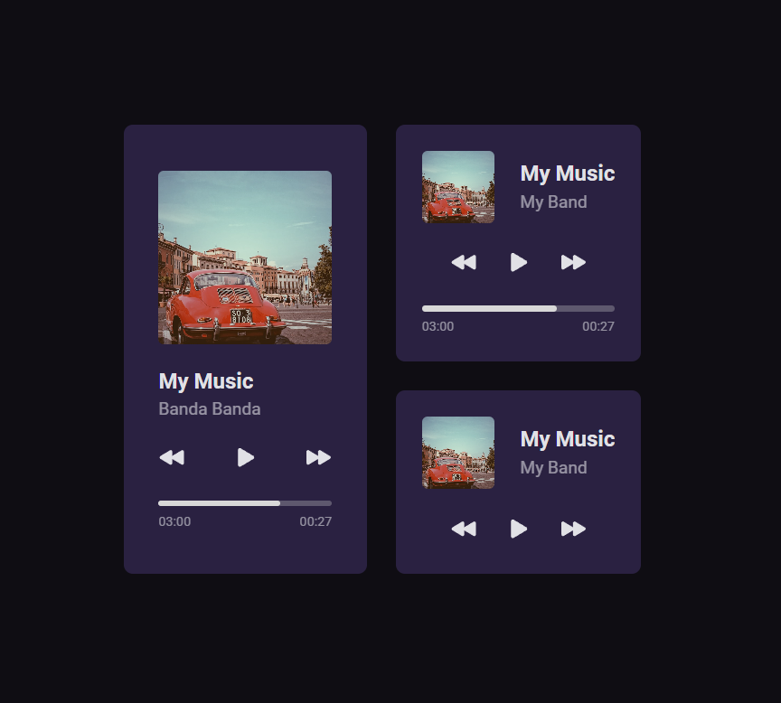

<h1 align="center">Music player</h1>

Static Music Player Layout.

  
  
  

## Future functionalities
+ [ ] Add a song
+ [ ] Add the functionality to play a song
+ [ ] Add a playlist

## Technologies
+ [HTML](https://developer.mozilla.org/pt-BR/docs/Web/HTML)
+ [CSS](https://www.typescriptlang.org/)

## How to use
Clone the repository and run it using a live server.

## Project

